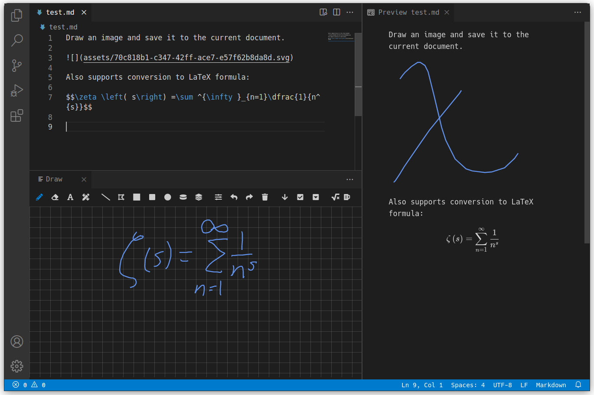

# Draw, for the VSCode family

[](https://open-vsx.org/extension/hall/draw)
[](https://marketplace.visualstudio.com/items?itemName=hall.draw)

Draw an SVG image with a mouse or pen.



> **NOTE**: This is an alpha project; please open an issue for any bugs, questions, or ideas!

## Usage

Open a file (in a supported format) and run `Draw: Edit current line` by either

 - right clicking on the line or
 - opening the command palette (`F1` or `Ctrl-Shft-P`) and type `svg`

The currently supported formats are

 - markdown
 - asciidoc
 - restructuredtext

## Custom Buttons

To add custom buttons to the toolbar, add an entry to the `draw.buttons` array in `settings.json`; for example,

```json
"draw.buttons": [
    {
        "icon": "beer",
        "title": "pour another",
        "function": "console.log('hooray!')"
    }
]
```

> search the [Font Awesome](https://fontawesome.com/v5/search?m=free) set for an icon

## Handwritten Text Recognition

Configure HTR with the `Draw: Configure HTR provider` command.

The following services are available to convert hand-written formulas to LaTeX equations.

### myscript

> free for 2000 calls/month

 - [create an account](https://developer.myscript.com/getting-started/web)
 - generate application and HMAC tokens
 - run `Draw: Configure HTR provider` and select `myscript`

<!-- ### mathpix

> free for 1000/month but you have to provide a card that will be charged a one-time non-refundable setup fee of $1

This script also supports drag and paste image.

 - copy the [mathpix.json](./docs/snippets/mathpix.json) snippet (which was generated by [mathpix.js](./docs/snippets/mathpix.js))
 - put it into `setting.json` (see [Custom Buttons](#custom-buttons))
 - replace `PasteYourTokenHere` with your token -->


## License

This project was forked from [zhaouv/vscode-markdown-draw](https://github.com/zhaouv/vscode-markdown-draw) and licensed under the [Apache-2.0 License](./LICENSE).
